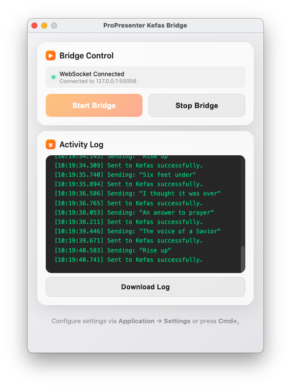
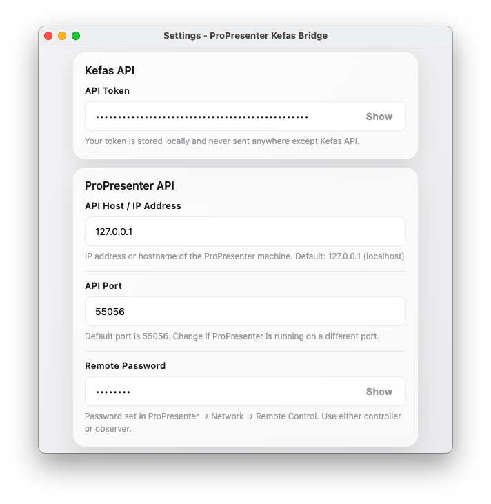
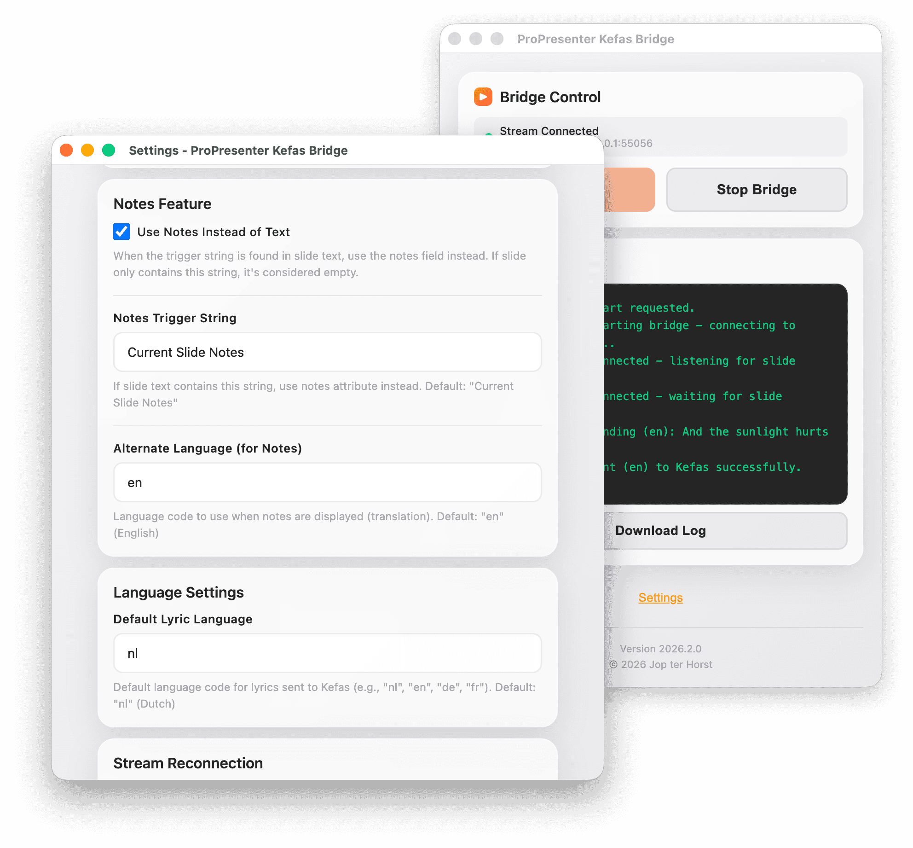

# ProPresenter Kefas Bridge

Automatically send lyrics from ProPresenter slides to Kefas in real-time using WebSocket triggers.

## What It Does

This app connects to ProPresenter via WebSocket and automatically sends the current slide lyrics to Kefas whenever you change slides. No polling, no delays—instant synchronization.



## Requirements

- **ProPresenter** with Remote Control enabled
- **Kefas account** with API token
- **macOS, Windows, or Linux**

## Quick Start

### 1. Get Your Kefas API Token

Log into your Kefas account and create an API token.

### 2. Enable ProPresenter Remote Control

In ProPresenter:
1. Go to **ProPresenter → Network**
2. Enable **Remote Control**
3. Set a password (optional but recommended)
4. Note the port (default: 55056)

### 3. Install & Launch

Download the app for your platform and run it.

### 4. Configure

Enter in the app Settings:
- **Kefas API Token** — Your token from step 1
- **ProPresenter Host** — IP address or hostname (default: 127.0.0.1)
- **ProPresenter Port** — Usually `55056`
- **Remote Control Password** — Password set in ProPresenter (if any)

Click **Save Settings**.

### 5. Start

1. Open ProPresenter
2. Click **Start Bridge** in this app
3. Watch the connection indicator turn green
4. Change slides in ProPresenter — lyrics sync automatically to Kefas

## Settings

| Setting | Default | Notes |
|---------|---------|-------|
| Kefas Token | — | Required |
| ProPresenter Host | 127.0.0.1 | IP or hostname of ProPresenter machine |
| ProPresenter Port | 55056 | Network API port |
| Remote Control Password | — | Optional, set in ProPresenter Network settings |
| Use Notes Instead | Off | Use slide notes when triggered |
| Notes Trigger | "Current Slide Notes" | Trigger string |
| Max Reconnection Attempts | 3 | Number of times to retry if connection drops |
| Reconnection Delay | 5 seconds | Wait time between reconnection attempts |
| Debug Mode | Off | Verbose logging |

### Settings Interface





## Using Notes Instead of Text

### What Is This?

By default, the app sends the slide's main text to Kefas. You can enable **Use Notes Instead** to send the slide's notes field instead.

### When to Use This

This is useful when you have **bilingual lyrics** in ProPresenter:
- Main text contains both original language and translation
- Notes field contains only the original language
- You want Kefas to display only the original language

**Example:**
- Slide text: "Amazing Grace (Geweldige Genade)"
- Slide notes: "Amazing Grace"
- With notes enabled, only "Amazing Grace" sends to Kefas

### How It Works

When you use ProPresenter's slide notes feature with bilingual content:
- ProPresenter displays the slide text with a "Current Slide Notes" label
- This label appears when the notes box is visible on the slide
- The app detects this label and automatically switches to sending the notes instead

### How to Enable

1. Check **Use Notes Instead of Text**
2. The default **Notes Trigger String** is `"Current Slide Notes"`
   - This matches the label ProPresenter displays when using slide notes
   - Change this if you use a custom ProPresenter template with a different label

When the app detects the trigger string in the slide text, it automatically uses the notes field instead of the main text.

## Connection Status

The app shows a real-time connection indicator:
- **🟢 Green** — Connected to ProPresenter WebSocket
- **🟠 Orange** — Connecting or authenticating
- **🔴 Red** — Connection error
- **⚫ Gray** — Disconnected

## Automatic Reconnection

If the ProPresenter WebSocket connection drops, the app will automatically attempt to reconnect. The reconnection behavior can be configured in Settings:

- **Max Reconnection Attempts** (1-10, default: 3) — Number of reconnection attempts before the bridge stops
- **Reconnection Delay** (1-60 seconds, default: 5) — Wait time between each reconnection attempt

For example, with default settings, if the connection drops:
1. Attempt 1 fails → wait 5 seconds
2. Attempt 2 fails → wait 5 seconds
3. Attempt 3 fails → bridge stops automatically

This ensures the app doesn't consume resources trying to connect to an unavailable ProPresenter instance.

## Troubleshooting

### Bridge won't start
- Verify your Kefas token is correct
- Make sure ProPresenter is running on the configured host and port
- Check that Remote Control is enabled in ProPresenter → Network
- Verify the host/IP address is correct and reachable

### Connection errors
- Check the Remote Control password matches
- Ensure ProPresenter's Remote Control is enabled
- Verify the port number is correct (default: 55056)
- Try connecting from ProPresenter's built-in remote control test

### Lyrics not syncing
- Enable Debug Mode to see detailed logs
- Check ProPresenter has lyrics on the current slide
- Verify the WebSocket connection is green
- Check the Activity Log for error messages

### "Bridge API not available"
- Restart the app
- Check browser console for errors (Cmd+Option+I)

## Debug Mode

Enable Debug Mode in settings to see:
- WebSocket connection details
- API request details
- Response times
- Full error messages

The debug log is saved to `~/propresenter-kefas-bridge.log`

## Development

```bash
npm install
npm start              # Run in development
npm run build:mac      # Build for macOS
npm run build:win      # Build for Windows
npm run build:linux    # Build for Linux
```

## How It Works

1. **Connect** — Establishes WebSocket connection to ProPresenter
2. **Authenticate** — Sends password (if configured)
3. **Listen** — Waits for slide change events
4. **Extract** — Gets slide text or notes via API
5. **Send** — Posts to Kefas if content changed
6. **Log** — Shows status in the activity log

## Technical Details

- Uses ProPresenter 7 WebSocket API (protocol 701)
- Connects to `/remote` endpoint
- Listens for slide change events
- Fetches slide content from `/v1/status/slide` endpoint
- Event-driven architecture (no polling)